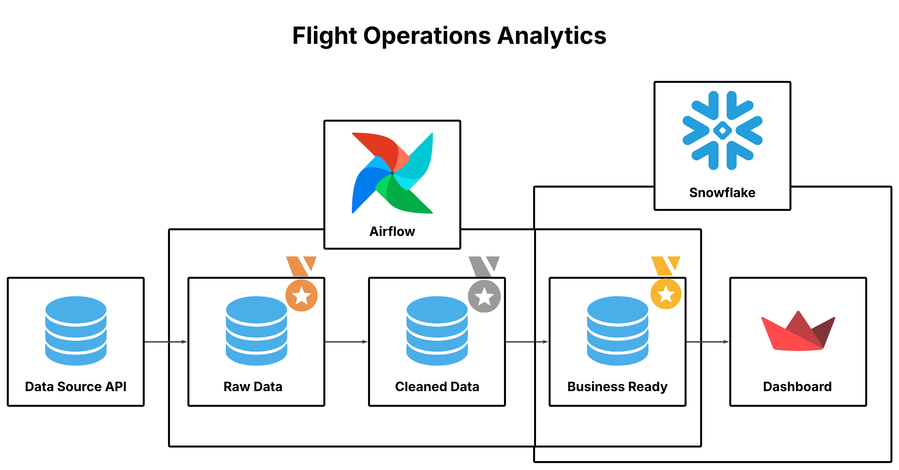

# Flights Operations Airflow Pipeline


---

## Project Overview
This project demonstrates an **end-to-end batch data pipeline** for the **Flight Operations domain**.  
Real-world flight data is fetched from an external API, processed through Python scripts, and orchestrated end-to-end using **Apache Airflow** — following best practices in pipeline design, scheduling, and containerized deployment.

---

## Architecture



**Pipeline Flow:**
1. **Data Ingestion** → Fetches live flight state data from the **OpenSky Network API** using Python (`requests`).  
2. **Scripts Layer** → Applies extraction and transformation logic via modular Python scripts.  
3. **PostgreSQL** → Serves as the Airflow metadata store.  
4. **Apache Airflow** → Orchestrates the full pipeline — scheduling DAG runs, managing task dependencies, and monitoring execution.  
5. **Snowflake** → Stores the processed Gold-layer table (`FLIGHTS.KPI.FLIGHT_KPIS`), aggregated by origin country.  
6. **Streamlit Dashboard** → Connects to Snowflake and visualizes flight operations insights interactively.

---

## Tech Stack
- **Apache Airflow 2.9.3** → Workflow orchestration & DAG scheduling  
- **Python** → Data ingestion scripts, API integration, and transformations  
- **OpenSky Network API** → Real-time flight state data source  
- **Snowflake** → Cloud Data Warehouse for the Gold-layer KPI table  
- **Streamlit** → Interactive dashboard app connected directly to Snowflake  
- **Altair** → Declarative charting library for all dashboard visualizations  
- **PostgreSQL 15** → Airflow metadata database  
- **Docker & docker-compose** → Fully containerized local environment  

---

## Key Features
- **OpenSky Network API ingestion** via Python `requests` with scheduled Airflow DAG triggers  
- **Modular script layer** separating ingestion logic from DAG orchestration  
- **Containerized Airflow stack** — webserver, scheduler, and Postgres all managed via Docker Compose  
- **Environment-variable-driven configuration** for secrets and connection strings (`.env` based)  
- **Snowflake Gold layer** (`FLIGHTS.KPI.FLIGHT_KPIS`) storing aggregated KPIs by origin country  
- **Interactive Streamlit dashboard** with dark glassmorphism UI, sidebar filters, and Altair charts  
- **Sidebar-driven filtering** by flight volume range, country selection, and on-ground toggle  

---

## Repository Structure
```text
flights-ops-airflow/
├── assets/                    # Workflow Architecture diagram
├── dags/                      # Airflow DAG definitions
├── dashboard/
│   └── streamlit_app.py       # Streamlit dashboard app (connects to Snowflake)
├── data/                      # Raw and processed data files
├── scripts/                   # Python ingestion & transformation scripts
├── .gitignore
├── Dockerfile                 # Custom Airflow image with dependencies
├── docker-compose.yml         # Multi-service containerized setup
├── requirements.txt           # Python dependencies
└── README.md
```

---

## ⚙️ Step-by-Step Implementation

### **1. Data Ingestion**
- Integrated with an external **flights operations API** using Python's `requests` library.
- Ingestion scripts are modularized under `scripts/` and invoked by Airflow tasks, keeping pipeline logic clean and testable.

---

### **2. Airflow Orchestration**
- DAGs defined in the `dags/` directory control the full end-to-end scheduling — from API fetch to data persistence.
- Airflow **webserver** (port `8080`) and **scheduler** are deployed as separate services, backed by **PostgreSQL** for metadata storage.
- Pipeline tasks are configured with dependencies, retry policies, and execution date awareness.

---

### **3. Containerized Deployment**
- A custom **Dockerfile** extends `apache/airflow:2.9.3` to install project-specific Python dependencies.
- **docker-compose.yml** orchestrates four services: `postgres`, `airflow-init`, `airflow-webserver`, and `airflow-scheduler`.
- Volumes are shared across services for DAGs, scripts, data, plugins, and logs — enabling a seamless local development experience.

---

### **4. Configuration & Secrets Management**
- All sensitive environment variables (Postgres credentials, Airflow admin credentials) are managed via a `.env` file.
- Connection strings are injected into Airflow via `AIRFLOW__DATABASE__SQL_ALCHEMY_CONN` environment variables.

---

### **5. Streamlit Dashboard**
The pipeline's Gold layer (`FLIGHTS.KPI.FLIGHT_KPIS` in Snowflake) is consumed by an interactive **Streamlit** app built with a premium dark glassmorphism UI and **Altair** charts.

**Sidebar Filters:**
- **Flight Volume Range** — slider to filter countries by total flights (min–max)
- **Country Multi-Select** — filter to one or more specific origin countries
- **On-Ground Toggle** — show only countries with aircraft currently on the ground
- **Top N Slider** — dynamically control how many countries appear in the bar chart (5–30)

**KPI Row (4 headline metrics):**
- **Countries** — number of origin countries in the filtered dataset
- **Total Flights** — sum of all flights across filtered countries
- **Avg Velocity (kn)** — mean ground speed across all filtered countries
- **Aircraft on Ground** — total count of grounded aircraft in filtered scope

**Chart 1 — Top N Countries by Total Flights (Horizontal Bar):**
Ranks the top N origin countries by flight count, color-encoded by volume using a blue-to-cyan gradient. Tooltip shows country, flights, and average velocity.

**Chart 2 — Avg Velocity vs Total Flights (Bubble Scatter):**
Log-scaled scatter plot with bubble size representing on-ground count and color intensity representing velocity (Turbo colorscheme). Reveals the relationship between flight volume and cruise speed by country.

**Chart 3 — On-Ground Distribution (Donut Chart):**
Shows the share of grounded aircraft across the top 10 countries plus an "Others" segment. Useful for identifying countries with high ground congestion.

**Chart 4 — Velocity Distribution (Histogram):**
Bins all filtered countries by average velocity, showing how airspeed clusters globally — helping spot outliers and normal operating ranges.

**Chart 5 — Ground Ratio Analysis (Horizontal Bar):**
Ranks the top 20 countries by their ground ratio (on-ground ÷ total flights × 100%), filtered to countries with at least 5 flights. Color-encoded from green (low ratio) to red (high ratio) to highlight congestion hotspots.

**Detailed Data Table:**
Fully searchable table of all filtered countries with columns for total flights, average velocity, on-ground count, and computed ground ratio — sortable and scrollable.

---

## 🚀 Getting Started

### Prerequisites
- Docker & Docker Compose installed
- A `.env` file in the project root with the following variables:

```env
POSTGRES_USER=your_user
POSTGRES_PASSWORD=your_password
POSTGRES_DB=airflow
AIRFLOW_ADMIN_USER=admin
AIRFLOW_ADMIN_FIRSTNAME=Admin
AIRFLOW_ADMIN_LASTNAME=User
AIRFLOW_ADMIN_EMAIL=admin@example.com
AIRFLOW_ADMIN_PASSWORD=your_password
```

### Run the Stack

```bash
# Clone the repository
git clone https://github.com/ghanysalam/flights-ops-airflow.git
cd flights-ops-airflow

# Start all services
docker compose up --build -d

# Access the Airflow UI
open http://localhost:8080
```

---

## 📊 Final Deliverables
- **Automated batch pipeline** from OpenSky Network API → Snowflake Gold layer
- **Airflow DAGs** with scheduling, retries, and task dependency management
- **Containerized infrastructure** ready for local development and demo
- **Modular Python scripts** for ingestion and transformation
- **Snowflake Gold table** (`FLIGHTS.KPI.FLIGHT_KPIS`) aggregated by origin country
- **Interactive Streamlit Dashboard** — dark glassmorphism UI with 4 KPI metrics, 5 Altair charts, sidebar filters, and a searchable data table

---

**Author**: *Ghany Salam*  
**LinkedIn**: [Ghany Salam](https://www.linkedin.com/in/ghanysalam/)  
**GitHub**: [ghanysalam](https://github.com/ghanysalam)